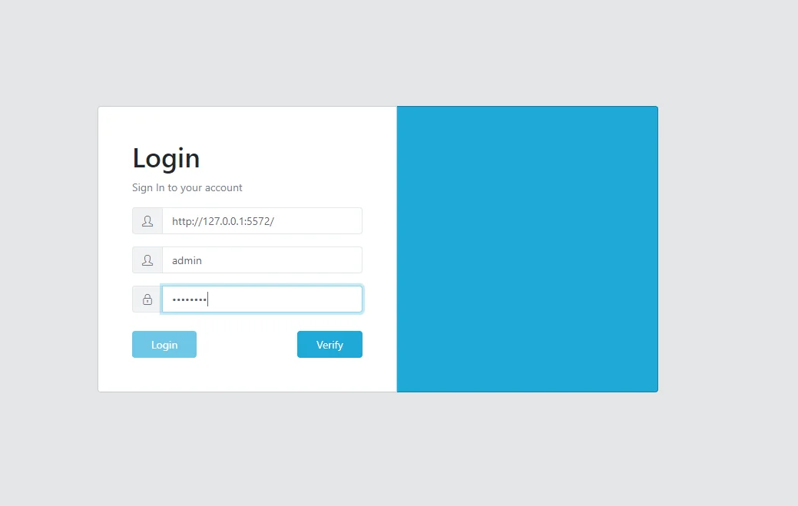

<!--
Ohart ongi: README hau automatikoki sortu da <https://github.com/YunoHost/apps/tree/master/tools/readme_generator>ri esker
EZ editatu eskuz.
-->

# Rclone YunoHost-erako

[](https://ci-apps.yunohost.org/ci/apps/rclone/)  

[](https://install-app.yunohost.org/?app=rclone)

*[Irakurri README hau beste hizkuntzatan.](./ALL_README.md)*

> *Pakete honek Rclone YunoHost zerbitzari batean azkar eta zailtasunik gabe instalatzea ahalbidetzen dizu.*  
> *YunoHost ez baduzu, kontsultatu [gida](https://yunohost.org/install) nola instalatu ikasteko.*

## Aurreikuspena

Rclone is a command-line program to manage files on cloud storage. It is a feature-rich alternative to cloud vendors' web storage interfaces. Over 70 cloud storage products support rclone including S3 object stores, business & consumer file storage services, as well as standard transfer protocols.

**Paketatutako bertsioa:** 1.68.1~ynh1

## Pantaila-argazkiak



## Dokumentazioa eta baliabideak

- Aplikazioaren webgune ofiziala: <https://rclone.org/>
- Erabiltzaileen dokumentazio ofiziala: <https://rclone.org/docs/>
- Jatorrizko aplikazioaren kode-gordailua: <https://github.com/rclone/rclone>
- YunoHost Denda: <https://apps.yunohost.org/app/rclone>
- Eman errore baten berri: <https://github.com/YunoHost-Apps/rclone_ynh/issues>

## Garatzaileentzako informazioa

Bidali `pull request`a [`testing` abarrera](https://github.com/YunoHost-Apps/rclone_ynh/tree/testing).

`testing` abarra probatzeko, ondorengoa egin:

```bash
sudo yunohost app install https://github.com/YunoHost-Apps/rclone_ynh/tree/testing --debug
edo
sudo yunohost app upgrade rclone -u https://github.com/YunoHost-Apps/rclone_ynh/tree/testing --debug
```

**Informazio gehiago aplikazioaren paketatzeari buruz:** <https://yunohost.org/packaging_apps>
